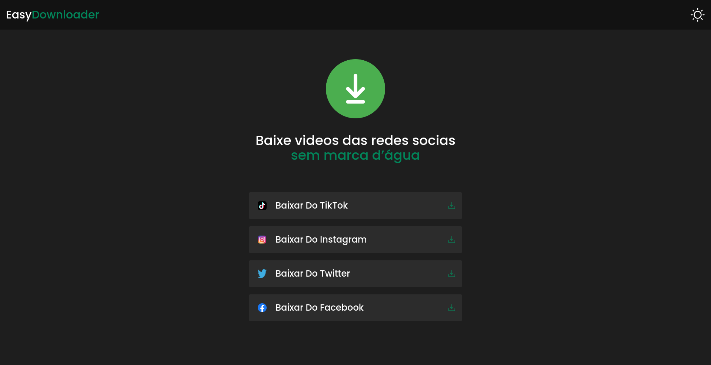

  <a href="#-Technologies">
Technologies</a>&nbsp;&nbsp;&nbsp;|&nbsp;&nbsp;&nbsp;
  <a href="#-Project">Project</a>&nbsp;&nbsp;&nbsp;|;

 

 

## 🚀 Technologies

This project was developed with the following technologies:

- React with Typescript
- Axios
- ContextApi
- TalwindCSS
- Backend NodeJS

Libraries

- [Google Fonts](https://fonts.google.com/)

Utilities

- [phospor-icons](https://phosphoricons.com/)

